## Introduction

In this blog post, we will compare different optimization algorithms for training a Convolutional Neural Network (CNN) on the MNIST dataset. The MNIST dataset consists of handwritten digits and is a common benchmark for evaluating machine learning models.

## Methodology

We trained a simple CNN model using various optimizers on the MNIST dataset. The optimizers used in this study are:

- SPSAOptimizerSimple
- SPSAOptimizerAdaptive
- KieferWolfowitzSimple
- KieferWolfowitzAdaptive
- Adam
- Adagrad
- SGD

The model architecture is as follows:

- Two convolutional layers with ReLU activation and max pooling.
- Two fully connected layers with ReLU activation.

We trained the model for 10 epochs with a batch size of 1024 and a learning rate of 0.01. The performance of each optimizer was evaluated based on training loss, test loss, training accuracy, test accuracy, compute cost, complexity, and training time.

## Results

<!-- ### Training and Test Loss

### Training and Test Accuracy

### Compute Cost and Complexity

### Training Time

 -->

### Predictions and Confusion Matrices

Below are the predictions and confusion matrices for each optimizer. Each figure shows a 4x4 grid of randomly sampled digits from the test set, along with the true and predicted labels.

#### SPSAOptimizerSimple

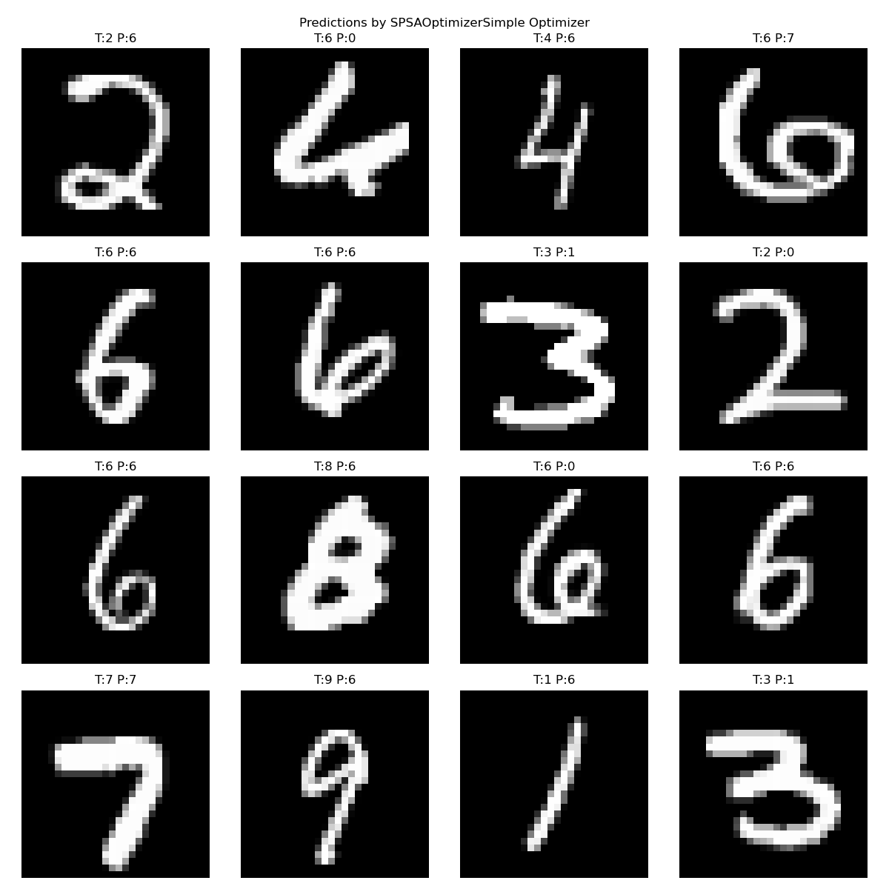
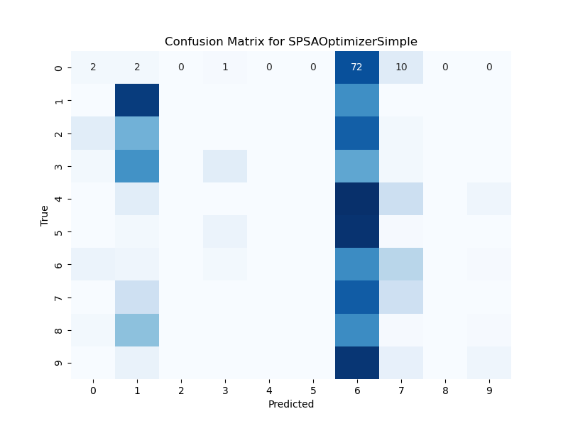

#### SPSAOptimizerAdaptive

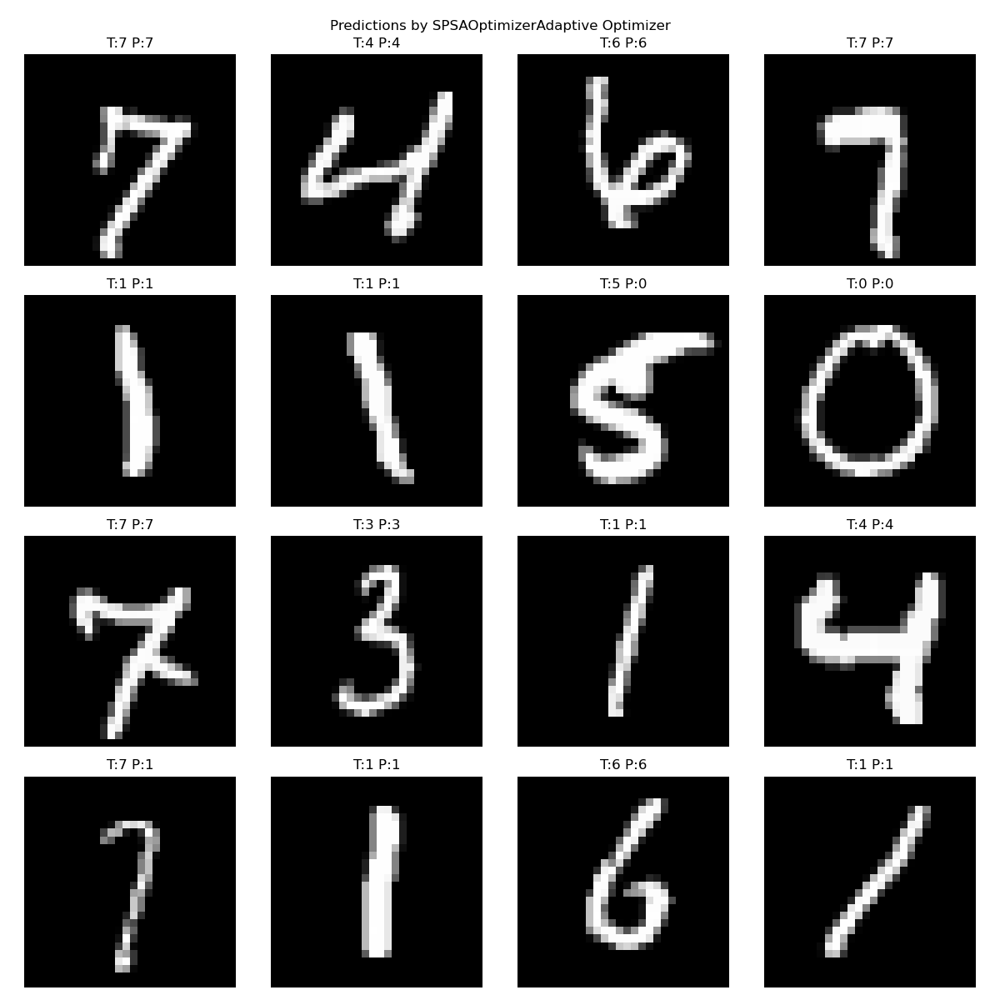
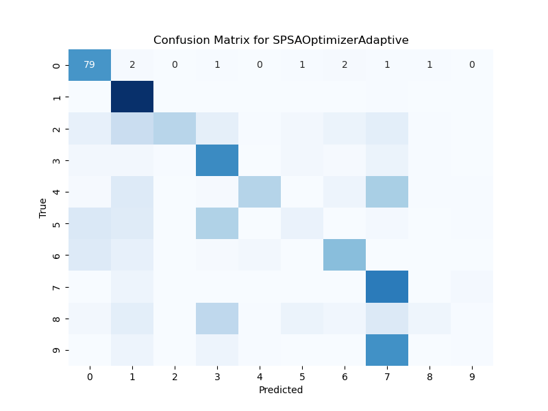

#### KieferWolfowitzSimple

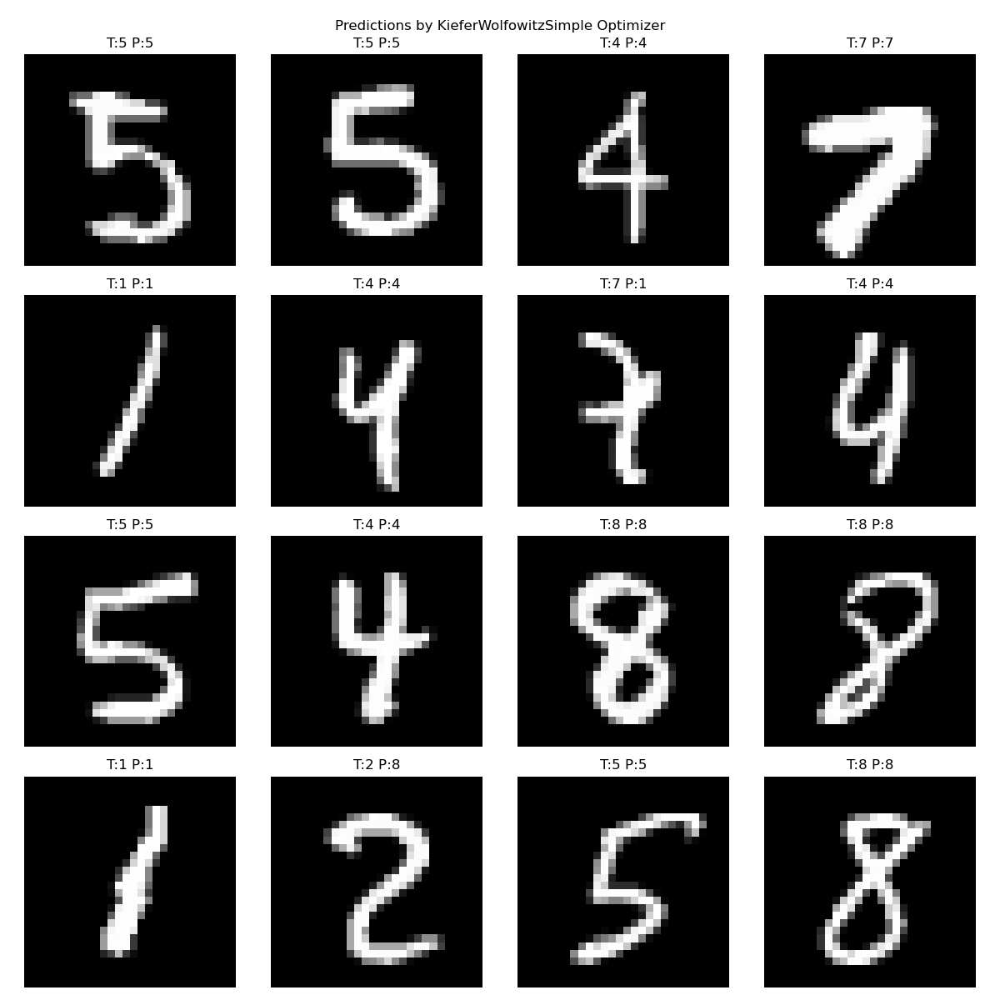
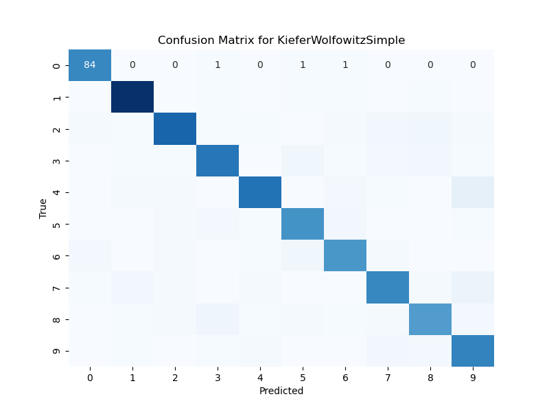

#### KieferWolfowitzAdaptive

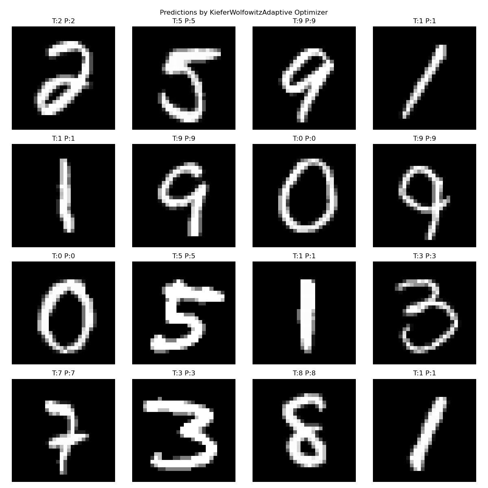
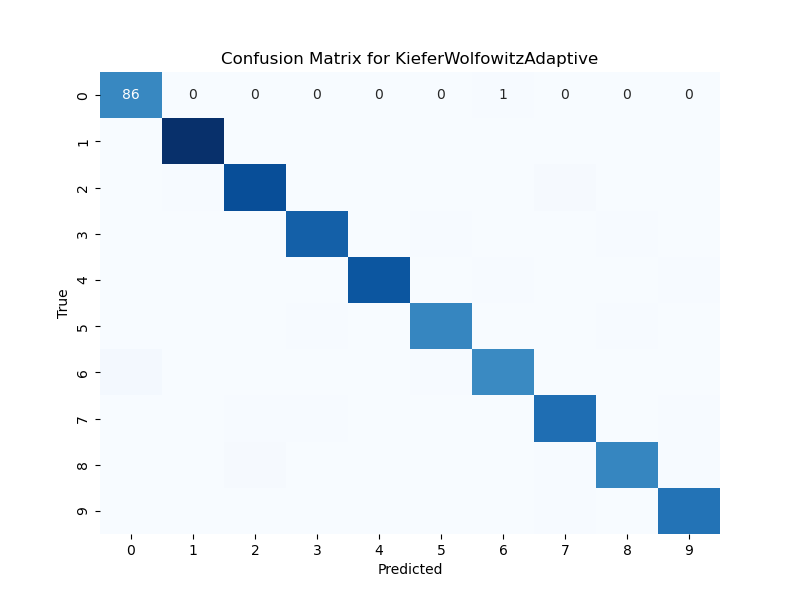

#### Adam

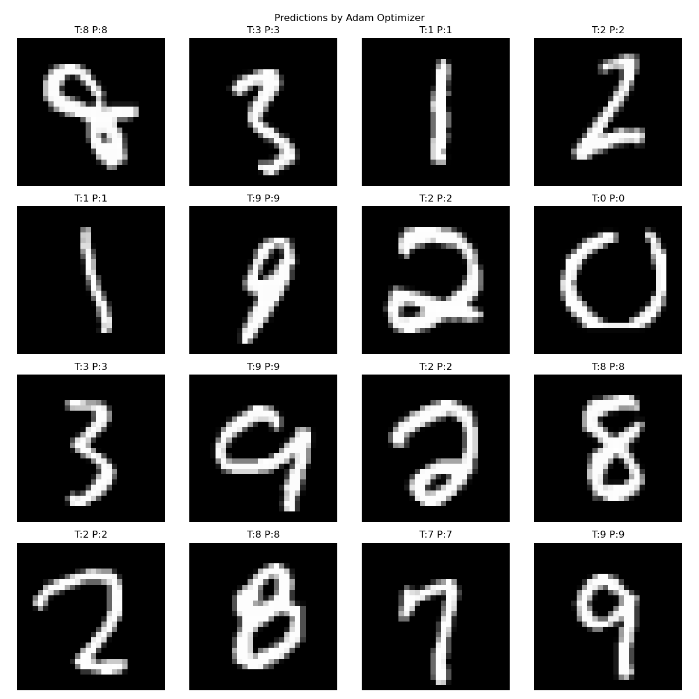

#### Adagrad

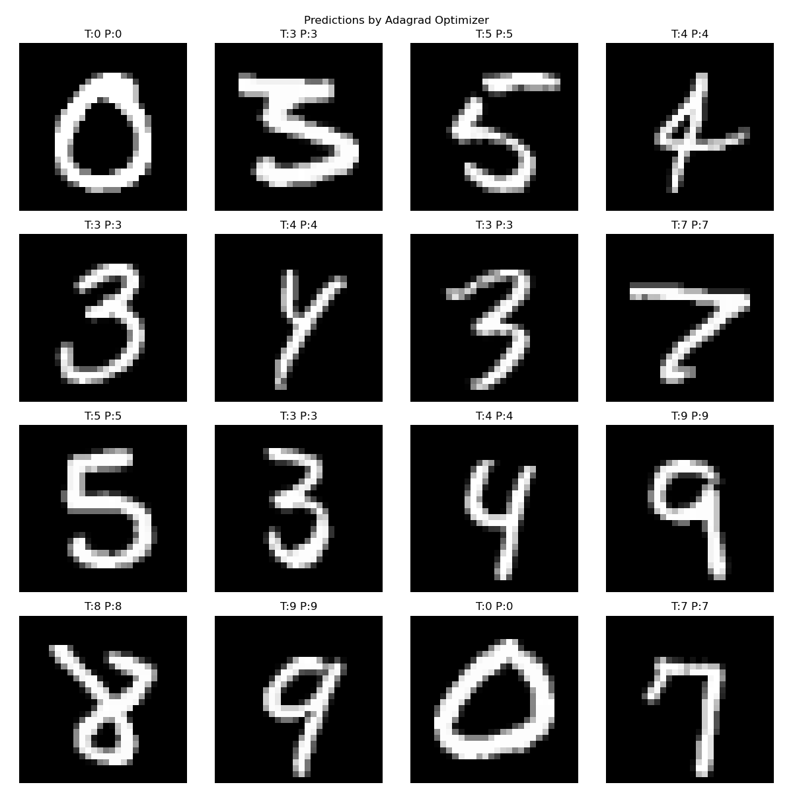
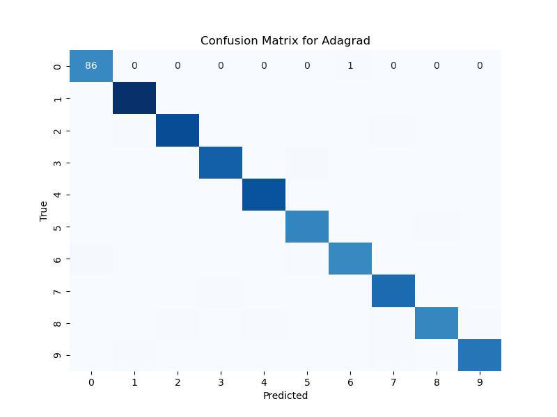

#### SGD

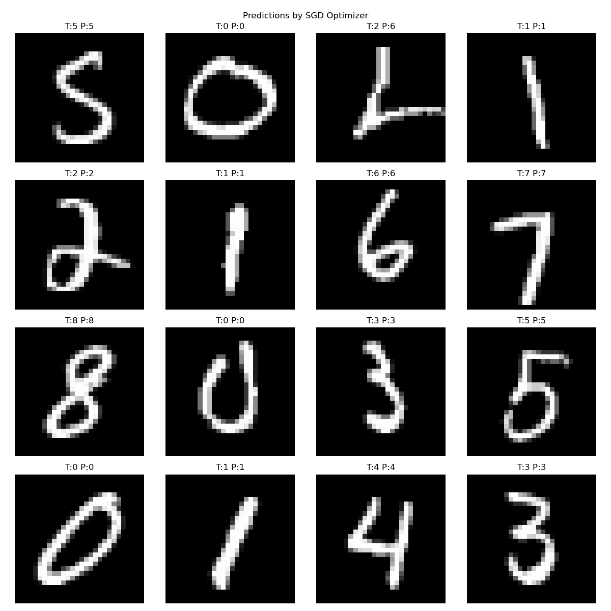
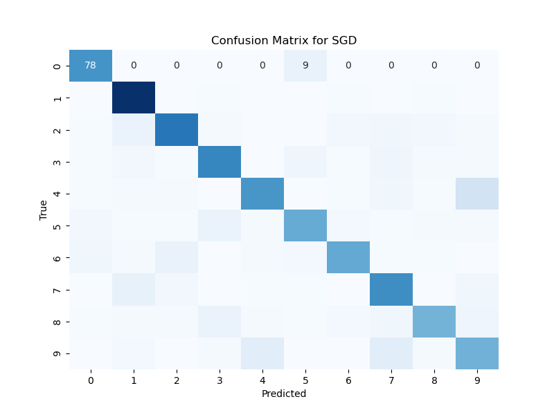

## Conclusion

From the results, we can observe that different optimizers have varying performance in terms of training loss, test loss, accuracy, compute cost, complexity, and training time. Adam optimizer consistently shows strong performance, while other optimizers like SPSA and Kiefer-Wolfowitz also show competitive results depending on the metric being considered.

This study provides insights into the trade-offs involved in selecting an optimizer for training neural networks. Depending on the specific requirements of the application, one can choose an optimizer that balances accuracy, computational efficiency, and memory usage.

Feel free to explore the code and reproduce the results. The code is available on my [GitHub repository](https://github.com/rg625/mnist-optimizer-comparison).

Happy experimenting!